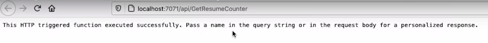
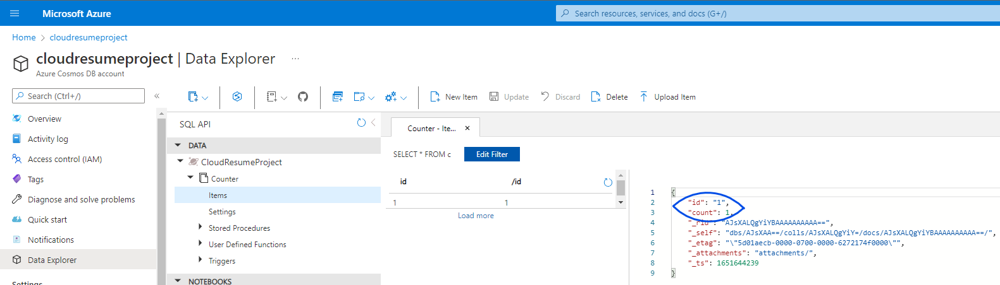
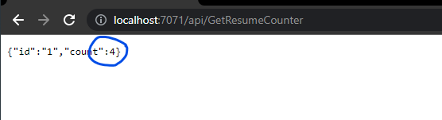

# API README
## *Usually I'm very professional, but **Sweet Baby Jesus** this is a BIG ONE, so pay attention in order  to avoid headaches*<hr>

## Table of Contents 
- [Cloud-Resume-Project](#cloud-resume-project) 
  - [Technologies Used:](#technologies-used)
  - [Challenges](#challenges)
  - [Diagram](#diagram)
  - [Credits](#credits)
    - [Project References](#project-references)
    - [Frontend](#frontend)
    - [Backend](#backend)
    - [Cloud](#cloud)
    - [Other](#other)
  - [License](#license)

<hr>

## Technologies Used:
- Languages: C#
- Framework: .NET Core 3, HTTPTrigger

<hr>

## Challenges
- Running Function Locally
- Running Azure Function
- Trouble Shooting Function Errors 
<hr>

# API Overview
## *Scope of API*
### The API, or Application Programming Interface, is a software intermeidary that allows two applications to talk to each other, in this instance our Cosmos DB and Website. We will make alterations to elements in the API folder, create a C# file, update our JSON (JavaScriptObjectNotation) settings, write our function, and test the function locally.

<hr>

## API
### HTML

modifications implemented were the inclusion of horizontal rules, adding validation links to certifications, and linking the design narrative to its corresponding Jira Page and GitHub Repo.


### Azure Function Extension
  **Note**

  *Be sure to download all of the resources found on the ACG Tutorial YouTube* 

- Create a new project and select browse
  - in the backend folder, select api
- Select C# as your language, .NET Core 3 as the framework, and HttpTrigger as the template
- Name the template "GetResumeCounter"
- Set access rights to "Function"
  - If you receive a message stating there are unresolved dependices, select restore

 ### GetResumeCounter.cs
 - Open the GetResumeCounter.cs file
 - Open the terminal and run "func host start"
   - Remember you do need to run this function where your API lives so make sure you're in the function folder
   - If running a function throws an error, make sure you have installed all of the necessary resources and Node.js npm
 - Once the function runs you will get a URL you can click on and go to and you will see this screen:
  
 

 - You can personalize this message by adding a query to the end of the url
  ```
?name="insert your name"
  ```

### CosmosDB
[Link to download other versions of the Nuget Package]((https://www.nuget.org/packages/Microsoft.Azure.WebJobs.Extensions.CosmosDB/3.0.10))

- Copy and the following .NET CLI and paste it in the terminal while you are located in the api folder
```
dotnet add package Microsoft.Azure.WebJobs.Extensions.CosmosDB --version 3.0.10
```
- Run the command, the package you will need to work with CosmosDB
- Navigate to the local.settings.json file


### Local.settings.json
- This is where we can save secrets and keys that we need to work
- This file remains local, so whenever we push our changes to GitHub the .gitignore file will make sure to ignore this file
- Add a the following key value pair


```
"(NAME OF YOUR DB)ConnectionString: " "
```


- Navigate to CosmosDB in your browser, go to settings in the side bar, and select "Keys"
- Copy the Primary Key string and paste it into your key pair


```
(NAME OF YOUR DB)ConnectionString: "Copied Primary Key "
```


- Save you changes

### Counter.cs
**Purpose of Counter.cs** 

*The purpose of the C# Class is to describe the counter object*

- Navigate to the backend folder and create new file called "Counter.cs"
- write the following code


```cs
using Newtonsoft.Json;

namespace Company.Function
{
    public class Counter
    {
        [JsonProperty(PropertyName ="id")]
```


- We will then set our "Id" string getters and setters as well as the json properties as such
  
```cs
using Newtonsoft.Json;

namespace Company.Function
{
    public class Counter
    {
        [JsonProperty(PropertyName ="id")]
        public string Id {get; set;}
```
*The purpose of getters and setters are to declare or obtain the values of varaible, usually private ones,
they are important because it allows for a central location taht is able to handle data prior to declaring it
or returnign it to the developer*

*A JSON object contains zero, one, or more key-value pairs, also called properties. JSON properties contain objects or values - no attributes*


- We will then set our "Count" interger getters and setters as well as the json properties

```cs
using Newtonsoft.Json;

namespace Company.Function
{
    public class Counter
    {
        [JsonProperty(PropertyName ="id")]
        public string Id {get; set;}

        [JsonProperty(PropertyName ="count")]
        public int Count {get;set;}
    }
}
```

- Note: If we navigate back to our CosmosDB Data Explorer we will see that the Item id and count matches our json properties




### CosmosDB Bindings
- Add our binding as follows:
  
```cs
public static HttpResponseMessage Run(
            [HttpTrigger(AuthorizationLevel.Function, "get", "post", Route = null)] HttpRequest req,
            [CosmosDB(databaseName:"NameofYourDatabase", collectionName: "Counter", ConnectionStringSetting = "NameofYourDatabaseConnectionString", Id = "1", PartitionKey = "1")] Counter counter,
            [CosmosDB(databaseName:"NameofYourDatabase", collectionName: "Counter", ConnectionStringSetting = "NameofYourDatabaseConnectionString", Id = "1", PartitionKey = "1")] out Counter updatedCounter,

            ILogger log)
        {
```

*The first binding allows us to retreive an item and allows us to retrieve an item that has the Id "1" by connecting to the database using the azure resume connection string; it does this by looking for the item named counter inside of the collection (or container) named "Nameofyourdatabase". The second binding is our output binding and provides the updated counter number* 

- add the following log:

```cs
            log.LogInformation("C# HTTP trigger function processed a request.");
```

- Add the following settings to the C# the top of your page to clear any code errors you may receive

```cs
using System.Net.Http;
using System.Text;
```

- Set the updated coutner object to be the same as the incoming counter object by entering the following:
```cs
updatedCounter = counter;
updatedCounter.Count += 1;
```

*This tells our input binding to grab and populate the "counter object" when the function is executed, and since the updated counter is what we're going to be returning to the databse to update the account information, the count is going to be increased by one.*

- Now structure the JSON that we want to return by entering:

```cs
var jsonToReturn = JsonConvert.SerializeObject(counter);
```
*This is what we're going to be seeing in the browser and what's going to be available via the API, JSON convert. It is serializing the object counter*

- Write the following return and return message:

```cs
return new HttpResponseMessage(System.Net.HttpStatusCode.OK)
  {
    Content = new StringContent(jsonToReturn, Encoding.UTF8, "application/json")
  };
```
### Testing the Function Locally

- Open your terminal and run the function while in the api folder:

```
func host start
```

- This will run our function and provide a URL; copy GetResumeCounter: "Generated URL" and open it into the browser
- If the function is successful you will see id and count on the screen, and whenever the page is refreshed the count will increase by one

)

- To reset the the counter back to zero navigate to your container in the azure portal and change the count back to zero

)


### Enable CORS
*CORS, or Cross-Origin Resource Sharing is an HTTP-header based mechanism that allows a server to indicate any origins other than its own, such as CosmosDB, from which a browser should permit loading resources*

- Navigate to the local.settings.json file and enter the following:

```json
,
  "Host":
  {
    "CORS": "*"
  }
}
```

- run the function with the command:
```powershell
func host start
```

- copy the URL Provided and place it in this location within the main.js file
```js
const functionApi = '<Insert URL Here'
```

- Now that the function is running locally and the counter data can be viewed in the browser we can now connect the backend to the frontend
<hr>

## Credits

### Project References

- <a href="https://github.com/madebygps/cgc-azure-resume">Cloud Guru Azure Resume Challenge.</a>
- <a href="https://www.youtube.com/watch?v=ieYrBWmkfno&t=281s">Cloud Guru Azure Resume Challenge Video</a>
  
## Resources API
- <a href="https://www.nuget.org/packages/Microsoft.Azure.WebJobs.Extensions.CosmosDB/3.0.10/">.NET CLI version used in video and in this project</a> 
<hr>