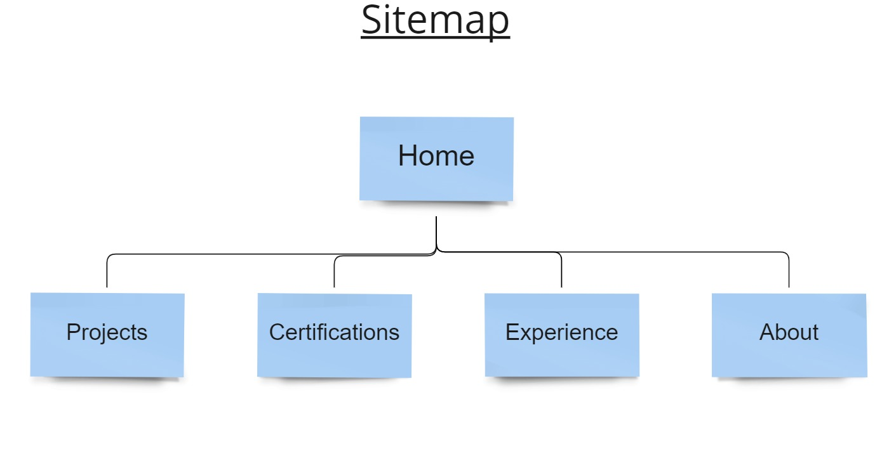

# Backend README
## *Frontend Readme detailing styling changes and HTML modifications*<hr>

## Table of Contents 
- [Cloud-Resume-Project](#cloud-resume-project) 
  - [Technologies Used:](#technologies-used)
  - [Challenges](#challenges)
  - [Diagram](#diagram)
  - [Credits](#credits)
    - [Project References](#project-references)
    - [Frontend](#frontend)
    - [Backend](#backend)
    - [Cloud](#cloud)
    - [Other](#other)
  - [License](#license)

<hr>

## Technologies Used:
- Languages: HTML, CSS, Markdown

<hr>

## Challenges
- Replacing Favicon link code with the code from Font Awesome
- Adding horizontal rule to resume sections
- Duplicating the education section
- Creating Frontend Readme 
<hr>

## Diagram 
<hr>

# backend Overview
## *Scope of Frontend*
### HTML document will be updated with personal information. After updates are made, a javascript file will be created and the visitor counter function will be written.  

<hr>

## Backend
### HTML

modifications implemented were the inclusion of horizontal rules, adding validation links to certifications, and linking the design narrative to its corresponding Jira Page and GitHub Repo.

### JavaScript
  **Purpose of the function**

  *The purpose of the function is to grab the JSON that is provided by the API, grab the correct part of that JSON, and show it in our HTML document.* 

- create file in frontend folder named 'main.js'.
- To call the function add an event listener named 'DOMContentLoaded' and get visit count
  ```js
  Window.addEventListener('DOMContentLoaded', (event) =>{
    getVisitCount();
  ```
-  Declare a constant named 'functionApi;. The function will require a URL to place in the single quotes, but we will this leave blank until later.
  ```js
  const functionApi ='';
  ```
- create constant and name it "getVisitCount
- declare variable, we used the number thirty
  ```js
  const getVisitCount = () => {
    let count = 30;
  ```
- write fetch function that fetch's the API and grabs the response and returns it to JSON
- Then grab the response and log a message to the console for debugging purposes
  ```js
  fetch(functionApi).then(response => {
        return response.json()
    }).then(response =>{
        console.log("Website called function API.");
  ```
- Now set variable to the created variable to the actualy data that's in the JSON response
- grab HTML document and get the element by the counter Id and then the inner text will be set to count data
  ```js
  count = response.count;
        document.getElementById("counter").innerText = count;
    }).catch(function(error){
  ```
- catch error, if present, and log the error message to the console
- return count
  ```js
  count = response.count;
        document.getElementById("counter").innerText = count;
    }).catch(function(error){
  ```
Update link to to next readme [Backend](C:\Users\jason\desktop\projects\cloud-resume-project\backend\README.md)
<hr>

## Credits

### Project References

- <a href="https://github.com/madebygps/cgc-azure-resume">Cloud Guru Azure Resume Challenge.</a>
- <a href="https://www.youtube.com/watch?v=ieYrBWmkfno&t=281s">Cloud Guru Azure Resume Challenge Video</a>
  
## Resources Frontend
- <a href="https://www.nuget.org/packages/Microsoft.Azure.WebJobs.Extensions.CosmosDB/3.0.10/">.Net CLI version used in video and in this project</a> 
  
  
<hr>
