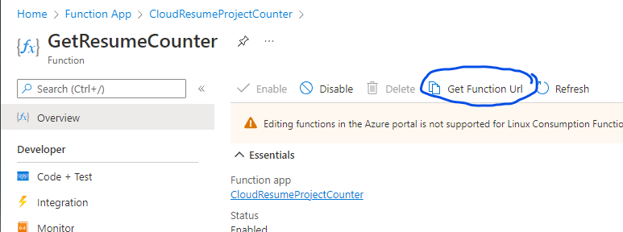

# Cloud README <!-- omit in toc -->
## *Cloud README detailing the steps taken in the Azure Portal to deploy an Azure Function*<hr> <!-- omit in toc -->

- [Cloud Overview](#cloud-overview)
  - [*Scope of Cloud Services*](#scope-of-cloud-services)
  - [Cloud/Backend](#cloudbackend)
    - [JavaScript](#javascript)
    - [Azure](#azure)
    - [CosmosDB](#cosmosdb)
    - [Azure Function](#azure-function)
  - [Deploying to Azure](#deploying-to-azure)
    - [*Scope of Azure Deployment*](#scope-of-azure-deployment)
    - [Deploy the Azure Function](#deploy-the-azure-function)
    - [Function App](#function-app)
    - [Main.js](#mainjs)
  - [Credits](#credits)
    - [Project References](#project-references)
<hr>

## Technologies Used:
- Languages: JavaScript
- Cloud: Azure, CosmosDB, Azure Function

<hr>

## Challenges
- Replacing Favicon link code with the code from Font Awesome
- Adding horizontal rule to resume sections
- Duplicating the education section
- Creating Frontend Readme 
<hr>

# Cloud Overview
## *Scope of Cloud Services*
### A Resource Group and CosmosDB Account will be created. Following creation a container will be generated and we will begin take the necessary steps to implement our backend Azure Function  <!-- omit in toc -->

<hr>

## Cloud/Backend

### JavaScript
  **Purpose of the function**

  The purpose of the function is to grab the JSON that is provided by the API, grab the correct part of that JSON and show it in our HTML document. 

- create file in frontend folder named 'main.js'. Declare a constant named 'functionApi;. The function will require a URL to place in the single quotes, but we will this leave blank until later.
- To call the function add an event listener named 'DOMContentLoaded' and get visit count
- create constant and name it "getVisitCount
- declare variable, we used the number thirty
- write fetch function that fetch's the API and grabs the response and returns it to JSON
- Then grab the response and log a message to the console for debugging purposes
- Now set variable to the created variable to the actualy data that's in the JSON response
- grab HTML document and get the element by the counter Id and then the inner text will be set to count data
- catch error, if present, and log the error message to the consle
- return count

### Azure
- In order to create a Cosmos DB account, you must first navigate to your subscription
- Enter "Cosmos DB" in the search bar and select the CosmosDB icon
- Create a new resource group and provide it with a name
- Provide a new account name
- Select Core SQL
- Select the region that works best for you | Note: ***You may run into issues with the Account creating, if so select an alternate region near your location*** |
- Select the serverless option, due to it's affordable pricing

### CosmosDB
- Select "Data Explorer" in the overview navigation menu located to the left side of the screen
- Select the dropdown menu labeled "Data", select you container, and create a new database
- Use your existing database id and give the counter id the name "counter"
- the partition key will not need to be edited for this project
  - partition key: a field that you use to distinguish between 
- Create container, expand the container, and select "Items"
- Create a new item and replace the text with the number "1"
- add counter as thus
  ```js
  "count":0, 
  ```
  - Save | Note: ***You will notice metadata being generated, this is standard and will not be used yet***
  
  ### Azure Function
    **Purpose of Azure Function**

    Azure Function is a serverless solution that allows us to create pieces of code that are event driven without the need to worry about the infrastructure behind the pieces of code. Azure Function also has a feature called "bindings" which allow us to connect other resources to our Function

- Update link to next readme [Backend]
  
## Deploying to Azure
### *Scope of Azure Deployment*
*During this phase of development we will depoloy the azure function to Azure, update the JavaScript function with the necessary URL, deploy the static site to our blob container, and set up Azure CDN for HTTPS and custom domain support.*


### Deploy the Azure Function
- navigate to the top of the repo and make sure your changes have been made adn pushed to GitHub
- go to the Azure Functions Extension and deploy the Function App by selection the option shown below:

  

- Select your subscription (being sure to use the advanced option)
- name your Function App
- select your runtime (in this instance we'll be using .NET Core 3.1)
- select Linux as the OS and select the consumption plan
- select the resource group you chose when you created your cosmos
- create and name a new storage account, (optional: create an application insight)
- Deploy the function
- Navigate to the local.settings.json file within the api folder and copy the AzureResumeConnectionString value (do not copy the quotations)

### Function App
- Navigate to the Azure portal, and open the Function App
- select the configuration option under settings and name your application "AzureResumeConnectionString"
- paste the copied value into the "Value" field
- select ok, save your changes, and select continue
- Navigate to Functions and select the funciton you created
- select the "Get Function URL" shown below:
  
  


### Main.js
- Once inside the main.js file write the following:
- 
```js
const functionApiUrl = ''
```

- insert your Url between the single quotations 
- rename the other constant the following:

```js
const localFunctionApi =
```

- update the fetch command to the following:
  
```js
fetch(functionApiUrl)
```

- Navigate back to the portal and Enable CORS (...to be continued)
 <hr>

## Credits

### Project References

- <a href="https://github.com/madebygps/cgc-azure-resume">Cloud Guru Azure Resume Challenge.</a>
- <a href="https://www.youtube.com/watch?v=ieYrBWmkfno&t=281s">Cloud Guru Azure Resume Challenge Video</a> 
<hr>